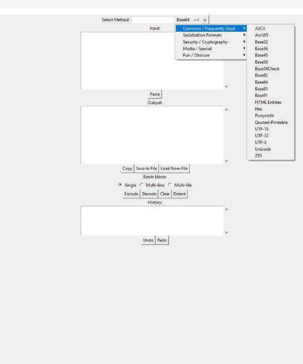

# Universal Encoder/Decoder GUI

A comprehensive Tkinter-based GUI tool for encoding and decoding text across multiple formats. Supports base encodings, cryptographic algorithms, hashes, serialization formats, and fun encodings like QR code generation and emoji encoding.

## Badges

[](https://www.python.org/downloads/)
[](https://opensource.org/licenses/MIT)
[](https://github.com/Zionn69/Universal-Encoder-Decoder/stargazers)
[](https://github.com/Zionn69/Universal-Encoder-Decoder/issues)

## Table of Contents

- [Features](#features)
- [Installation](#installation)
- [Usage](#usage)
- [Screenshots](#screenshots)
- [Roadmap](#roadmap)
- [Contributing](#contributing)
- [Credits](#credits)
- [License](#license)

## Features

### Encoding/Decoding Formats
- **Base Encodings**: Base16 (Hex), Base32, Base36, Base45, Base58, Base58Check, Base62, Base64, Base85, Base91, Ascii85, Z85
- **Text Encodings**: URL, HTML Entities, Quoted Printable, Punycode
- **Character Encodings**: ASCII, Extended ASCII, UTF-8, UTF-16, UTF-32, Unicode
- **Ciphers**: ROT13, ROT47, Atbash, Caesar, Vigenère, Affine, Playfair, Rail Fence, Polybius Square, Tap Code, XOR
- **Hashes**: MD5, SHA-1, SHA-256, SHA3-224, SHA3-256, SHA3-512, RIPEMD160, CRC32, Whirlpool
- **Cryptography**: AES, DES, RSA, Fernet, JWT (sign/decode)
- **Serialization**: CBOR, MessagePack, Bencode, S-Expressions
- **Special Formats**: Bech32, Armor64/PEM, BinHex, QR Code, Braille, DNA, Emoji, Morse Code, Leetspeak, Zalgo Text, Soundex, Brainfuck

### Utility Features
- Searchable method selection with categories
- Favorites system for quick access
- Copy/paste functionality
- Save/load text files
- History log with undo/redo
- Batch processing modes (single, multi-line, multi-file)
- Auto-detect codec for common formats
- QR code generation and saving

### Fun Encodings
- Emoji Encoding
- Binary-to-Music conversion
- Zalgo Text
- Brainfuck Encoder

## Installation

### Prerequisites
- Python 3.9 or higher
- pip (Python package installer)

### Clone the Repository
```bash
git clone https://github.com/Zionn69/universal-encoder-decoder-gui.git
cd universal-encoder-decoder-gui
```

### Install Dependencies
```bash
pip install -r requirements.txt
```

#### Manual Installation (if requirements.txt is not available)
```bash
pip install base58 PyJWT cryptography cbor2 pycryptodome msgpack bech32 qrcode[pil] zmq
```

Note: Some features may require additional libraries. The app will notify you if a required library is missing.

## Usage

Run the application with:
```bash
python base64_gui.py
```

### Basic Usage
1. Select an encoding/decoding method from the dropdown menu
2. Enter your text in the input box
3. Click "Encode" or "Decode"
4. View the result in the output box
5. Use "Copy" to copy the output or "Save to File" to save it

### Advanced Features
- **Search**: Use the search bar to filter methods
- **Favorites**: Click the star button to add methods to favorites
- **Batch Mode**: Choose between single, multi-line, or multi-file processing
- **History**: View and navigate through previous operations
- **Auto-Detect**: Click "Detect" to automatically identify common encoding formats

## Screenshots



*Main interface showing encoding options and input/output areas*

## Roadmap

- [ ] Add more encoding/decoding formats (e.g., Base122, BSON)
- [ ] Implement theme support (dark/light mode)
- [ ] Add command-line interface for batch processing
- [ ] Support for image encoding/decoding (Base64 images)
- [ ] Integration with online APIs for additional formats
- [ ] Performance optimizations for large files
- [ ] Plugin system for custom encodings
- [ ] Cross-platform testing and improvements

## Contributing

Contributions are welcome! Please follow these steps:

1. Fork the repository
2. Create a feature branch (`git checkout -b feature/AmazingFeature`)
3. Commit your changes (`git commit -m 'Add some AmazingFeature'`)
4. Push to the branch (`git push origin feature/AmazingFeature`)
5. Open a Pull Request

### Development Setup
```bash
git clone https://github.com/Zionn69/universal-encoder-decoder-gui.git
cd universal-encoder-decoder-gui
pip install -r requirements.txt
# Make your changes
python base64_gui.py  # Test your changes
```

## Credits

**Author**: Zion

**GitHub**: [https://github.com/Zionn69](https://github.com/Zionn69)

**Reddit**: [https://www.reddit.com/user/Zionn67/](https://www.reddit.com/user/Zionn67/)

## License

This project is licensed under the MIT License - see the [LICENSE](LICENSE) file for details.

---

*Made with ❤️ for developers and security enthusiasts*
